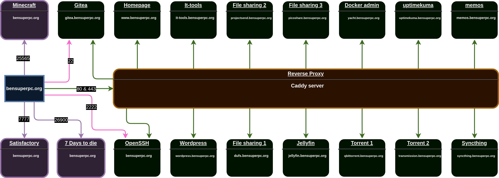
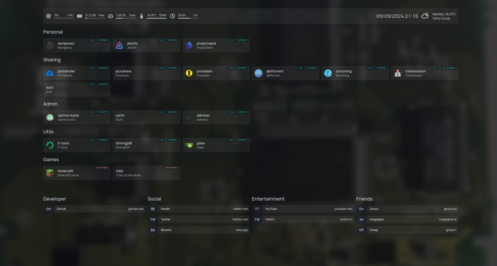

# Infrastructure

_Open source, decentralized and self-hosted infrastructure for many services._

## About

It uses caddy and docker-compose to run my services (And many other things).
It's a **work in progress**, and I'm still learning a lot about it.
If you have any **questions** or **suggestions**, feel free to open an issue or a pull request.

## Features

- [x] caddy 2 HTTP/S reverse proxy
- [x] Docker / docker-compose
- [x] Wordpress (Via FASTCGI/caddy)
- [x] Jellyfin (Media server)
- [x] Gitea (Git server)
- [x] Uptime Kuma (Monitoring)
- [x] qbittorrent and transmission (Torrent client/server)
- [x] SyncThing (File synchronization)
- [x] PsiTransfer, ProjectSend, Picoshare (File sharing)
- [x] it-tools (Tools for IT)
- [x] Privatebin (Pastebin)
- [x] Yacht (Web interface for managing docker containers)
- [ ] Integrate games ([Satisfactory](https://github.com/bensuperpc/docker-satisfactory), [7 days to die](https://github.com/bensuperpc/docker-7daystodie), Minecraft...)

## Architecture



## Screenshots

The homepage is a dashboard with many widgets and services.



## Installation and configuration

### Requirements

- [Docker](https://docs.docker.com/install/)
- [Docker Compose](https://docs.docker.com/compose/install/)
- [Git](https://git-scm.com/book/en/v2/Getting-Started-Installing-Git)
- [Web domain](https://www.ovh.com/world/domains/) (I use OVH)
- [Open port 80, 443, 22 and 2222 on your router](http://192.168.1.1/)

***To avoid get rate limit from letsencrypt (10 certificates per 3 hours), you need to disable some certificates in the caddyfiles and enable them 3h later...***

### Clone

Clone this repository to your local machine using:

```sh
git clone --recurse-submodules --remote-submodules https://github.com/bensuperpc/infrastructure.git
```

Go to the folder

```sh
cd infrastructure
```

### Configure the domain

For all **bensuperpc.org**, you need to replace it with your domain, example: **mydomain.com**, so the same for **bensuperpc.com** ect...

```sh
find . \( -type d -name .git -prune \) -o -type f -print0 | xargs -0 sed -i 's/bensuperpc.org/mydomain.com/g'
```

Check if all bensuperpc.* are replaced by your domain in [Caddyfile](caddy/wordpress/Caddyfile)

And then, caddy will generate the certificate for you and renew it automatically :D

| Domain name | Type | Description |
| --- | --- | --- |
| [bensuperpc.org](https://bensuperpc.org) | Main | Redirect to www.bensuperpc.org |
| [www.bensuperpc.org](https://www.bensuperpc.org) | Main | Homepage |
| [wordpress.bensuperpc.org](https://wordpress.bensuperpc.org) | Sub | Wordpress website |
| [adminer.bensuperpc.org](https://adminer.bensuperpc.org) | Sub | Adminer for MariaDB for wordpress only |
| [uptimekuma.bensuperpc.org](https://uptimekuma.bensuperpc.org) | Sub | Uptime Kuma for monitoring |
| [qbittorrent.bensuperpc.org](https://qbittorrent.bensuperpc.org) | Sub | Torrent client/server |
| [transmission.bensuperpc.org](https://transmission.bensuperpc.org) | Sub | Torrent client/server |
| [git.bensuperpc.org](https://git.bensuperpc.org) | Sub | Gitea for git |
| [link.bensuperpc.org](https://link.bensuperpc.org) | Sub | For link shortener |
| [jellyfin.bensuperpc.org](https://jellyfin.bensuperpc.org) | Sub | Jellyfin for media server |
| [syncthing.bensuperpc.org](https://syncthing.bensuperpc.org) | Sub | SyncThing for file synchronization |
| [psitransfer.bensuperpc.org](https://psitransfer.bensuperpc.org) | Sub | PsiTransfer for file sharing |
| [it-tools.bensuperpc.org](https://it-tools.bensuperpc.org) | Sub | Tools for IT |
| [privatebin.bensuperpc.org](https://privatebin.bensuperpc.org) | Sub | Pastebin |
| [yacht.bensuperpc.org](https://yacht.bensuperpc.org) | Sub | Web interface for managing docker containers |
| [projectsend.bensuperpc.org](https://projectsend.bensuperpc.org) | Sub | ProjectSend for file sharing |
| [picoshare.bensuperpc.org](https://picoshare.bensuperpc.org) | Sub | Picoshare for file sharing |
| [dufs.bensuperpc.org](https://dufs.bensuperpc.org) | Sub | Dufs for file sharing |
| bensuperpc.com | Main | Redirect to www.bensuperpc.org |
| bensuperpc.fr | Main | Redirect to www.bensuperpc.org |
| bensuperpc.net | Main | Redirect to www.bensuperpc.org |
| bensuperpc.ovh | Main | Redirect to www.bensuperpc.org |

### Configure the infrastructure

You need to configure the infrastructure with your own configuration.

You can generate a password with 32 characters:

```sh
openssl rand -base64 32
```

Or online: [passwordsgenerator.net](https://passwordsgenerator.net/)

For [caddy_backup.env](infrastructure/caddy/env/caddy_backup.env) file, you need to change the password(s) for the restic backup.
```sh
RESTIC_PASSWORD=7L1Ncbquax0B2TCOmrjaQl9n5mnY88bQ
```

For the [wordpress.env](infrastructure/wordpress/env/wordpress.env) file, you need to change the password and user for the database.

```sh
WORDPRESS_DB_USER=bensuperpc
WORDPRESS_DB_PASSWORD=lEOEf8cndnDjp84O4Uv5D9zJLJDFatLw
```

For [wordpress_db.env](infrastructure/wordpress/env/wordpress_db.env) file, you need to change the password(s) and user for the database.
    
```sh
MARIADB_ROOT_PASSWORD=7L1Ncbquax0B2TCOmrjaQl9n5mnY88bQ
MARIADB_USER=bensuperpc
MARIADB_PASSWORD=lEOEf8cndnDjp84O4Uv5D9zJLJDFatLw
```

For [wordpress_backup.env](infrastructure/wordpress/env/wordpress_backup.env) file, you need to change the password(s) for the restic backup.
```sh
RESTIC_PASSWORD=7L1Ncbquax0B2TCOmrjaQl9n5mnY88bQ
```

For [adminer.env](infrastructure/wordpress/env/adminer.env) file, you need to change the password(s) and user for the database.

```sh
MARIADB_ROOT_PASSWORD=7L1Ncbquax0B2TCOmrjaQl9n5mnY88bQ
MARIADB_USER=bensuperpc
MARIADB_PASSWORD=lEOEf8cndnDjp84O4Uv5D9zJLJDFatLw
```

For [gitea.env](infrastructure/gitea/env/gitea.env) file, you need to change the password(s) and user for the database.

```sh
GITEA__database__USER=bensuperpc
GITEA__database__PASSWD=K7s5yoHknnEd7vsZoxb8I3dK9mjToF1j
GITEA__security__SECRET_KEY=ykcZt23an1E4lFHWvrCKdAyt16WAiK9c
```

For [gitea_db.env](infrastructure/gitea/env/gitea_db.env) file, you need to change the password(s) and user for the database.

```sh
MARIADB_ROOT_PASSWORD=xpc4zIhHZzWKqVHcjBu4aW6aS7jG8d7X
MARIADB_USER=bensuperpc
MARIADB_PASSWORD=K7s5yoHknnEd7vsZoxb8I3dK9mjToF1j
```

For [psitransfer.env](infrastructure/psitransfer/env/psitransfer.env) file, you need to change the secret key.

```sh
PSITRANSFER_ADMIN_PASS=n9jLVNT9QUotTJTT91JqH4GyBTg9pvEn
```

For [yacht.env](infrastructure/yacht/env/yacht.env) file, you need to change the secret key.

```sh
SECRET_KEY=UZvg9nbcGIJlPEB3uI39TAEWyFOz9nm8
```

For [projectsend_db.env](infrastructure/projectsend/env/projectsend_db.env) file, you need to change the password(s) and user for the database.

```sh
MARIADB_ROOT_PASSWORD=8O34297GrBfT3Ld34Lfg9mpotmZwbJtt
MARIADB_USER=bensuperpc
MARIADB_PASSWORD=wdSUa1JEZhXie5AJ5NcX1w73xmpO12EY
```

For [picoshare.env](infrastructure/picoshare/env/picoshare.env) file, you need to change the secret key.

```sh
PS_SHARED_SECRET=CBuS4DJLqIe93xF1KGYRrnhxUFBqLD2n
```

For [dufs.env](infrastructure/dufs/env/dufs.env) file, you need to change the secret key and if you want the user name.

```sh
DUFS_AUTH="admin:heqihlOfBmJDESGFlpbPi7P7Mi6F7RkV@/:rw|@/:ro"
```

For [stirlingpdf.env](infrastructure/stirlingpdf/env/stirlingpdf.env) file, it's **completly optional**, you can change the password(s) and user.

```sh
# Enable security, optional
DOCKER_ENABLE_SECURITY=true
SECURITY_ENABLE_LOGIN=true
# Can be disabled after initial login, optional,
# default it admin:stirling
SECURITY_INITIALLOGIN_USERNAME=admin
SECURITY_INITIALLOGIN_PASSWORD=Jw9U039f5xc2mFcacvGvPD9RjwIh4DzO
```

You can need to add/change the public ssh key [id_ed25519.pub](infrastructure/openssh/config/authorized_keys/id_ed25519.pub) (its my public key), also change the user name in [openssh.env](infrastructure/openssh/env/openssh.env):

```sh
USER_NAME=bensuperpc
```

### Start the infrastructure

Start the website with:

```sh
make start-at
```

Stop the website with (or CTRL+C with the previous command):

```sh
make stop
```

Remove countainers with:

```sh
make down
```

You can disable some services by removing the service name in PROFILES variable in the [Makefile](Makefile) file.

To enable the gitea CI: https://medium.com/@lokanx/how-to-build-docker-containers-using-gitea-runners-600729555e07

### Homepage

You can change the homepage config in these files:

- [bookmarks.yaml](infrastructure/homepage/config/bookmarks.yaml)
- [services.yaml](infrastructure/homepage/config/services.yaml)
- [settings.yaml](infrastructure/homepage/config/settings.yaml)
- [widgets.yaml](infrastructure/homepage/config/widgets.yaml)

### Docker volumes

This infrastructure uses docker volumes to store data, all configuration/data for each service are not shared between services for security and maintenance reasons, but **public_data** and **private_data** are shared between all services to store your data.

| Volume name | Description |
| --- | --- |
| public_data | Public data reachable on internet via [dufs.bensuperpc.org](https://dufs.bensuperpc.org), can be disabled. |
| private_data | Private data |

### SSH access

The default port for ssh/rsync is is 2222.

## Sources

- [Wordpress](https://wordpress.org/)
- [Gnu Make](https://www.gnu.org/software/make/)
- [Github API](https://docs.github.com/en/rest)
- [Github Actions](https://docs.github.com/en/actions)
- [Docker](https://www.docker.com/)
- [Docker Compose](https://docs.docker.com/compose/)
- [Docker Hub](https://hub.docker.com/)
- [How To Start WordPress with Caddy using Docker Compose](https://minhcung.me/how-to-start-wordpress-with-caddy-using-docker-compose-3d31bb9ef88b)
- [Digital Ocean - How To Install WordPress with Docker Compose (nginx)](https://www.digitalocean.com/community/tutorials/how-to-install-wordpress-with-docker-compose)
- [Imagisphe](https://imagisphe.re/)
- [Letsencrypt](https://letsencrypt.org/)
- [Caddy](https://caddyserver.com/)
- [Adminer](https://www.adminer.org/)
- [Uptime Kuma](https://uptime-kuma.com/)
- [qbittorrent](https://www.qbittorrent.org/)
- [Transmission](https://transmissionbt.com/)
- [Gitea](https://gitea.io/)
- [Jellyfin](https://jellyfin.org/)
- [SyncThing](https://syncthing.net/)
- [PsiTransfer](https://psitransfer.com/)
- [It-tools](https://github.com/CorentinTh/it-tools)
- [Privatebin](https://github.com/PrivateBin/PrivateBin)
- [ghost](https://ghost.org)
- [Homepage Tuto](https://belginux.com/installer-homepage-avec-docker/)
- [Yacht](https://yacht.sh/)
- [ProjectSend](https://www.projectsend.org/)
- [Picoshare](https://github.com/mtlynch/picoshare)
- [Dufs](https://github.com/sigoden/dufs)
- [Fix docker volume](https://pratikpc.medium.com/use-docker-compose-named-volumes-as-non-root-within-your-containers-1911eb30f731)

## License

[License](LICENSE)
