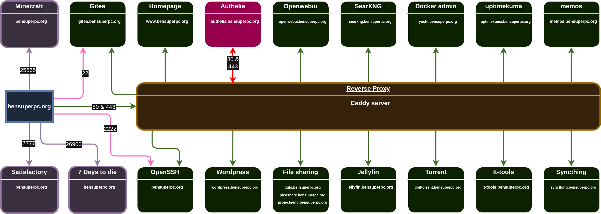
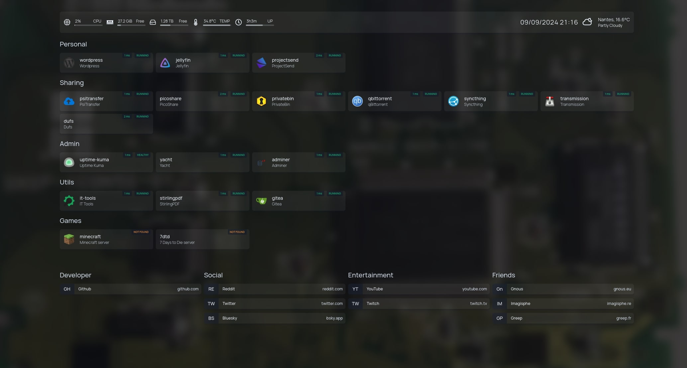

# Infrastructure

_Open source, decentralized and self-hosted infrastructure for many local services and authentication with Authelia._

## Features

- [x] caddy 2 HTTP/S reverse proxy
- [x] Authelia (SSO / authentication middleware)
- [x] Open-WebUI + Ollama (Local chatGPT)
- [x] qbittorrent and transmission (Torrent client/server)
- [x] Docker / docker-compose
- [x] Homepage (Dashboard)
- [x] SearXNG (Self-hosted search engine)
- [x] Jellyfin (Eg Netflix, Disney+)
- [x] Forgejo (Git server, fork of Gitea)
- [x] Uptime Kuma (Monitoring)
- [x] Argus (Application update monitoring)
- [x] SyncThing (File synchronization)
- [x] Dufs (File server)
- [x] PsiTransfer, ProjectSend, Picoshare (File sharing)
- [x] it-tools, omni-tools and cyberchef (Tools for IT)
- [x] Privatebin
- [x] Memos (Note-taking)
- [x] Stirling PDF (PDF tools)
- [x] Wordpress (Via FASTCGI/caddy)
- [x] Dependency-Track (SBOM / vulnerability tracking)
- [X] Game (Satisfactory, Minecraft, 7 Days to Die, Team Fortress 2 etc...)

## Architecture



## Screenshots

The homepage is a dashboard with many widgets and services.



## Installation and configuration

### Requirements

- [Docker](https://docs.docker.com/install/)
- [Docker Compose](https://docs.docker.com/compose/install/)
- [Git](https://git-scm.com/book/en/v2/Getting-Started-Installing-Git)
- [Web domain](https://www.ovh.com/world/domains/) (I use OVH)
- [Open port 80, 443, 22 and 2222 on your router](http://192.168.1.1/)
- For games server, you need to open these ports (7777, 8888, 25565, 26900, 26901, 26903)

List of ports used by the services in this infrastructure:

| Port number | Service       | Description       |
| ----------- | ------------- | ----------------- |
| 80          | Caddy         | HTTP traffic      |
| 443         | Caddy         | HTTPS traffic     |
| 22          | Forgejo       | Git/SSH access    |
| 2222        | OpenSSH       | Global SSH access |
| 7777        | Satisfactory  | Game server port  |
| 8888        | Satisfactory  | Game server port  |
| 25565       | Minecraft     | Game server port  |
| 8100        | Bluemap Minecraft | Web map port  |
| 26900       | 7 Days to Die | Game server port  |
| 26901       | 7 Days to Die | Game server port  |
| 26903       | 7 Days to Die | Game server port  |
| 27015       | Team Fortress 2 | Game server port |


**To avoid get rate limit from letsencrypt (10 certificates per 3 hours), you need to disable some certificates in the caddyfiles and enable them 3h later...**

### Clone

Clone this repository to your local machine using:

```sh
git clone --recurse-submodules --remote-submodules https://github.com/bensuperpc/infrastructure.git
```

Go to the folder

```sh
cd infrastructure
```

### Start the infrastructure

Start the website with:

```sh
make up
```

Stop the website with:

```sh
make stop
```

Remove containers with:

```sh
make down
```

Services are enabled via **preset configuration files** in the [`presets/`](presets/) directory. 

The active presets are declared in the [`Makefile`](Makefile) via the `CONFIGS` variable, for example, `CONFIGS := chatgpt` loads `presets/chatgpt.conf` which activates the `main_infrastructure`, `caddy`, `openssh`, and `openwebui` profiles.

### Configure the domain

For all **bensuperpc.org**, you need to replace it with your domain, example: **mydomain.com**, so the same for **bensuperpc.com** ect...

```sh
find . \( -type d -name .git -prune \) -o -type f -print0 | xargs -0 sed -i 's/bensuperpc.org/mydomain.com/g'
```

Check if all bensuperpc.* are replaced by your domain in [Caddyfile](infrastructure/services/caddy/config/Caddyfile)

And then, caddy will generate the certificate for you and renew it automatically :D

| Domain name                                                        | Type | Description                                                  |
| ------------------------------------------------------------------ | ---- | ------------------------------------------------------------ |
| [bensuperpc.org](https://bensuperpc.org)                           | Main | Redirect to [www.bensuperpc.org](https://www.bensuperpc.org) |
| [www.bensuperpc.org](https://www.bensuperpc.org)                   | Main | Homepage                                                     |
| [openwebui.bensuperpc.org](https://openwebui.bensuperpc.org)       | Sub  | For local chatGPT with ollama and openweb-ui                 |
| [authelia.bensuperpc.org](https://authelia.bensuperpc.org)         | Sub  | Authelia for authentication                                  |
| [uptimekuma.bensuperpc.org](https://uptimekuma.bensuperpc.org)     | Sub  | Uptime Kuma for monitoring                                   |
| [qbittorrent.bensuperpc.org](https://qbittorrent.bensuperpc.org)   | Sub  | Torrent client/server                                        |
| [dozzle.bensuperpc.org](https://dozzle.bensuperpc.org)             | Sub  | Dozzle for docker logs                                       |
| [transmission.bensuperpc.org](https://transmission.bensuperpc.org) | Sub  | Torrent client/server                                        |
| [forgejo.bensuperpc.org](https://forgejo.bensuperpc.org/)          | Sub  | Fork of Gitea for git                                        |
| [git.bensuperpc.org](https://git.bensuperpc.org)                   | Sub  | Fork of Gitea for git                                        |
| [jellyfin.bensuperpc.org](https://jellyfin.bensuperpc.org)         | Sub  | Jellyfin for media server                                    |
| [syncthing.bensuperpc.org](https://syncthing.bensuperpc.org)       | Sub  | SyncThing for file synchronization                           |
| [psitransfer.bensuperpc.org](https://psitransfer.bensuperpc.org)   | Sub  | PsiTransfer for file sharing                                 |
| [it-tools.bensuperpc.org](https://it-tools.bensuperpc.org)         | Sub  | Tools for IT                                                 |
| [omni-tools.bensuperpc.org](https://omni-tools.bensuperpc.org)     | Sub  | Tools for IT                                                 |
| [privatebin.bensuperpc.org](https://privatebin.bensuperpc.org)     | Sub  | Privatebin                                                   |
| [projectsend.bensuperpc.org](https://projectsend.bensuperpc.org)   | Sub  | ProjectSend for file sharing                                 |
| [picoshare.bensuperpc.org](https://picoshare.bensuperpc.org)       | Sub  | Picoshare for file sharing                                   |
| [dufs.bensuperpc.org](https://dufs.bensuperpc.org)                 | Sub  | Dufs for file sharing                                        |
| [memos.bensuperpc.org](https://memos.bensuperpc.org)               | Sub  | Memos note-taking app                                        |
| [stirlingpdf.bensuperpc.org](https://stirlingpdf.bensuperpc.org)   | Sub  | Stirling PDF tools                                           |
| [argus.bensuperpc.org](https://argus.bensuperpc.org)               | Sub  | Argus for monitoring application updates                     |
| [searxng.bensuperpc.org](https://searxng.bensuperpc.org)           | Sub  | SearXNG self-hosted search engine                            |
| [dependency-track.bensuperpc.org](https://dependency-track.bensuperpc.org) | Sub | SBOM / vulnerability analysis                       |
| [wordpress.bensuperpc.org](https://wordpress.bensuperpc.org)       | Sub  | Wordpress website                                            |

### Configure the infrastructure

You need to configure the infrastructure with your own configuration.

You can generate a password with 32 characters:

```sh
openssl rand -base64 32
```

Or online: [passwordsgenerator.net](https://passwordsgenerator.net/)

#### Caddy

For [caddy_backup.env](infrastructure/services/caddy/env/caddy_backup.env) file, you need to change the password(s) for the restic backup.

```sh
RESTIC_PASSWORD=7L1Ncbquax0B2TCOmrjaQl9n5mnY88bQ
```

On [caddy.env](infrastructure/services/caddy/env/caddy.env) file, you need to update some variables, like the main domain, mail domain and scheme (http or https).

```sh
MAIN_DOMAIN=bensuperpc.org
MAIL_DOMAIN=bensuperpc@gmail.com
# Scheme
SCHEME=https
# ignore_loaded_certs off
AUTO_HTTPS_OPTIONS=ignore_loaded_certs
```

#### Authelia

For [authelia.env](infrastructure/services/authelia/env/authelia.env) file, you need to change the password(s) and secret key:

```sh
AUTHELIA_IDENTITY_VALIDATION_RESET_PASSWORD_JWT_SECRET=ht87MVnXkXhBpDkMUHqKDqdg8UGBJt+Fx5jNIqXnN2k=
AUTHELIA_SESSION_SECRET=nsvbXKGRXVZUCUkOapntlq/Zh+d75WacTK5Jgyh8zYk=
AUTHELIA_STORAGE_ENCRYPTION_KEY=aWeIT74xIhGVd9nUOr4YTToTl5rpBEbzc/fv4jemuos=
AUTHELIA_STORAGE_POSTGRES_HOST=authelia-postgres
AUTHELIA_STORAGE_POSTGRES_PORT=5432
AUTHELIA_STORAGE_POSTGRES_DATABASE=authelia_db
AUTHELIA_STORAGE_POSTGRES_USERNAME=authelia
AUTHELIA_STORAGE_POSTGRES_PASSWORD=sAdkxFW6k3GiMOrlBpl6OV76eb9cQz/uk95jmA2UpI8=
```

Same for [authelia_postgres.env](infrastructure/services/authelia/env/authelia_postgres.env) file, you need to change the password(s) and user for the database.

```sh
POSTGRES_USER=authelia
POSTGRES_PASSWORD=sAdkxFW6k3GiMOrlBpl6OV76eb9cQz/uk95jmA2UpI8=
POSTGRES_DB=authelia_db
```

You also need to update [users_database.yml](infrastructure/services/authelia/config/users_database.yml)

```sh
docker run --rm authelia/authelia:latest authelia crypto hash generate argon2 --password 'MyPassword'
```

#### Dozzle

To generate a new user for dozzle, you can use the following command [users.yml](infrastructure/services/dozzle/config/users.yml):

```sh
docker run -it --rm amir20/dozzle generate bensuperpc --password mypassword --email bensuperpc@gmail.com --name "bensuperpc"
```

#### PsiTransfer

For [psitransfer.env](infrastructure/services/psitransfer/env/psitransfer.env) file, you need to change the secret key.

```sh
PSITRANSFER_ADMIN_PASS=n9jLVNT9QUotTJTT91JqH4GyBTg9pvEn
```

For [projectsend_db.env](infrastructure/services/projectsend/env/projectsend_db.env) file, you need to change the password(s) and user for the database.

```sh
MARIADB_ROOT_PASSWORD=8O34297GrBfT3Ld34Lfg9mpotmZwbJtt
MARIADB_USER=bensuperpc
MARIADB_PASSWORD=wdSUa1JEZhXie5AJ5NcX1w73xmpO12EY
```

#### Picoshare

For [picoshare.env](infrastructure/services/picoshare/env/picoshare.env) file, you need to change the secret key.

```sh
PS_SHARED_SECRET=CBuS4DJLqIe93xF1KGYRrnhxUFBqLD2n
```

#### Dufs

For [dufs.env](infrastructure/services/dufs/env/dufs.env) file, you need to change the secret key and if you want the user name.

```sh
DUFS_AUTH="admin:heqihlOfBmJDESGFlpbPi7P7Mi6F7RkV@/:rw|@/:ro"
```

#### Stirling PDF

For [stirlingpdf.env](infrastructure/services/stirlingpdf/env/stirlingpdf.env) file, it's **completly optional**, you can change the password(s) and user.

```sh
# Enable security, optional
DOCKER_ENABLE_SECURITY=true
SECURITY_ENABLE_LOGIN=true
# Can be disabled after initial login, optional,
# default it admin:stirling
SECURITY_INITIALLOGIN_USERNAME=admin
SECURITY_INITIALLOGIN_PASSWORD=Jw9U039f5xc2mFcacvGvPD9RjwIh4DzO
```

#### OpenSSH

You can need to add/change the public ssh key [id_ed25519.pub](infrastructure/services/openssh/config/authorized_keys/id_ed25519.pub) (its my public key), also change the config/password in [openssh.env](infrastructure/services/openssh/env/openssh.env):

```sh
SUDO_ACCESS=true
#PUBLIC_KEY_URL=https://github.com/bensuperpc.keys
PUBLIC_KEY_DIR=/authorized_ssh_keys
USER_PASSWORD=rdUwf36C11PLmpU9Lvq7tP5pfFBKAuCh

#PUBLIC_KEY=yourpublickey
#PUBLIC_KEY_FILE=/path/to/file
#PUBLIC_KEY_DIR=/path/to/directory/containing/_only_/pubkeys
#USER_PASSWORD_FILE=/path/to/file
```

#### Open-WebUI

For [open-webui.env](infrastructure/services/open-webui/env/open-webui.env) file, you must change the secret key for the webui and configure its PostgreSQL backend.

```sh
WEBUI_SECRET_KEY=7d83b15a417d090ba5c6b899270a05dd215c60848354c0c7574226d6ff02f39e
```

Also update [openwebui-postgres.env](infrastructure/services/open-webui/env/openwebui-postgres.env) with your own credentials.

To download the model, through open-webui GUI or you can use the following command:

```sh
docker exec -it ollama ollama run deepseek-r1:8b
```

#### Dependency-Track

For [dependency-track.env](infrastructure/services/dependency-track/env/dependency-track.env) file, you need to set the database credentials and the API server URL.

```sh
POSTGRES_USER=dtrack
POSTGRES_PASSWORD=<your_password>
POSTGRES_DB=dtrack_db
ALPINE_DATA_DIRECTORY=/data
```

The frontend is available at `https://dependency-track.bensuperpc.org` and the API server at `/api/*`. Default credentials are `admin` / `admin`, **change them on first login**.

### Homepage

You can change the homepage config in these files:

- [bookmarks.yaml](infrastructure/services/homepage/config/bookmarks.yaml)
- [services.yaml](infrastructure/services/homepage/config/services.yaml)
- [settings.yaml](infrastructure/services/homepage/config/settings.yaml)
- [widgets.yaml](infrastructure/services/homepage/config/widgets.yaml)

### Forgejo

For Forgejo installation, you must change the password(s) and user in [forgejo_db.env](infrastructure/services/forgejo/env/forgejo_db.env) file and [forgejo.env](infrastructure/services/forgejo/env/forgejo.env) file.

Once the installation is complete, you need to set the installation lock:

```sh
FORGEJO__security__INSTALL_LOCK=true
```

### Forgejo Runner (Out of date)

```sh
docker exec -it forgejo_runner /bin/bash
```

```sh
forgejo-runner generate-config > /data/config.yml
```

Now update the config.yml file to support docker-in-docker:

```yml
  envs:
    DOCKER_TLS_VERIFY: 1
    DOCKER_CERT_PATH: /certs/client
    DOCKER_HOST: tcp://docker:2376
  labels: ["ubuntu-latest:docker://node:20-bookworm", "ubuntu-22.04:docker://node:20-bookworm"]
  network: host
  options: -v /certs/client:/certs/client
  valid_volumes:
     - /certs/client
```

Register the runner with your Forgejo instance:


```sh
forgejo-runner register
```

You will need to provide the following information:

```sh
https://forgejo.bensuperpc.org/
<Your Registration Token, in https://forgejo.bensuperpc.org/admin/actions/runners>
ubuntu-22.04:docker://ghcr.io/catthehacker/ubuntu:act-24.04
main
```

### Docker volumes

This infrastructure uses docker volumes to store data, all configuration/data for each service are not shared between services for security and maintenance reasons, but **public_data** and **private_data** are shared between all services to store your data.

| Volume name  | Description                                                                                                |
| ------------ | ---------------------------------------------------------------------------------------------------------- |
| public_data  | Public data reachable on internet via [dufs.bensuperpc.org](https://dufs.bensuperpc.org), can be disabled. |
| private_data | Private data                                                                                               |

### SSH access

The default port for SSH/rsync is 2222.

You can access to the server with:

```sh
ssh -p 2222 admin@bensuperpc.org
```

### Qbittorrent

To activate the alternative webui theme (VueTorrent), you need to go in the qbittorrent settings, then in the `webui` section, check the `Use alternative webui` and add `/vuetorrent` to text field.


### Local testing

If you want to test the infrastructure locally, you can add these lines in your `/etc/hosts` file:

```sh
127.0.0.1 openwebui.bensuperpc.org
127.0.0.1 authelia.bensuperpc.org
127.0.0.1 memos.bensuperpc.org
127.0.0.1 stirlingpdf.bensuperpc.org
127.0.0.1 public.bensuperpc.org
127.0.0.1 private.bensuperpc.org
127.0.0.1 jellyfin.bensuperpc.org
127.0.0.1 syncthing.bensuperpc.org
127.0.0.1 psitransfer.bensuperpc.org
127.0.0.1 projectsend.bensuperpc.org
127.0.0.1 picoshare.bensuperpc.org
127.0.0.1 dufs.bensuperpc.org
127.0.0.1 it-tools.bensuperpc.org
127.0.0.1 omni-tools.bensuperpc.org
127.0.0.1 privatebin.bensuperpc.org
127.0.0.1 forgejo.bensuperpc.org
127.0.0.1 git.bensuperpc.org
127.0.0.1 qbittorrent.bensuperpc.org
127.0.0.1 transmission.bensuperpc.org
127.0.0.1 uptimekuma.bensuperpc.org
127.0.0.1 wordpress.bensuperpc.org
127.0.0.1 searxng.bensuperpc.org
127.0.0.1 dependency-track.bensuperpc.org
127.0.0.1 homepage.bensuperpc.org
```

Then update the [caddy.env](infrastructure/services/caddy/env/caddy.env) file with your local domain to disable the letsencrypt certificate generation and auto redirect to https:

```sh
MAIN_DOMAIN=bensuperpc.org
# Scheme
SCHEME=https
# ignore_loaded_certs off
AUTO_HTTPS_OPTIONS=ignore_loaded_certs
```

And remove all the `import authelia_middleware` in the caddyfiles, authelia need https to work.

#### Wordpress

For the [wordpress.env](infrastructure/services/wordpress/env/wordpress.env) file, you need to change the password and user for the database.

```sh
WORDPRESS_DB_USER=bensuperpc
WORDPRESS_DB_PASSWORD=lEOEf8cndnDjp84O4Uv5D9zJLJDFatLw
```

For [wordpress_db.env](infrastructure/services/wordpress/env/wordpress_db.env) file, you need to change the password(s) and user for the database.

```sh
MARIADB_ROOT_PASSWORD=7L1Ncbquax0B2TCOmrjaQl9n5mnY88bQ
MARIADB_USER=bensuperpc
MARIADB_PASSWORD=lEOEf8cndnDjp84O4Uv5D9zJLJDFatLw
```

For [wordpress_backup.env](infrastructure/services/wordpress/env/wordpress_backup.env) file, you need to change the password(s) for the restic backup.

```sh
RESTIC_PASSWORD=7L1Ncbquax0B2TCOmrjaQl9n5mnY88bQ
```

## Sources

- [Wordpress](https://wordpress.org/)
- [Gnu Make](https://www.gnu.org/software/make/)
- [Github API](https://docs.github.com/en/rest)
- [Github Actions](https://docs.github.com/en/actions)
- [Docker](https://www.docker.com/)
- [Docker Compose](https://docs.docker.com/compose/)
- [Docker Hub](https://hub.docker.com/)
- [How To Start WordPress with Caddy using Docker Compose](https://minhcung.me/how-to-start-wordpress-with-caddy-using-docker-compose-3d31bb9ef88b)
- [Digital Ocean - How To Install WordPress with Docker Compose (nginx)](https://www.digitalocean.com/community/tutorials/how-to-install-wordpress-with-docker-compose)
- [Imagisphe](https://imagisphe.re/)
- [Letsencrypt](https://letsencrypt.org/)
- [Caddy](https://caddyserver.com/)
- [Adminer](https://www.adminer.org/)
- [self-hosted-ai-stack](https://triedandtestedbuilds.com/self-hosted-ai-stack-part-1)
- [Uptime Kuma](https://uptime-kuma.com/)
- [qbittorrent](https://www.qbittorrent.org/)
- [Transmission](https://transmissionbt.com/)
- [Gitea](https://gitea.io/)
- [Jellyfin](https://jellyfin.org/)
- [SyncThing](https://syncthing.net/)
- [PsiTransfer](https://psitransfer.com/)
- [It-tools](https://github.com/CorentinTh/it-tools)
- [Omni-tools](https://github.com/iib0011/omni-tools)
- [Privatebin](https://github.com/PrivateBin/PrivateBin)
- [ghost](https://ghost.org)
- [Homepage Tuto](https://belginux.com/installer-homepage-avec-docker/)
- [ProjectSend](https://www.projectsend.org/)
- [Picoshare](https://github.com/mtlynch/picoshare)
- [Dufs](https://github.com/sigoden/dufs)
- [demos](https://github.com/usememos/memos)
- [Stirling PDF](https://github.com/Stirling-Tools/Stirling-PDF)
- [open-webui](https://github.com/open-webui/open-webui)
- [Fix docker volume](https://pratikpc.medium.com/use-docker-compose-named-volumes-as-non-root-within-your-containers-1911eb30f731)
- [Forgejo-runner](https://code.forgejo.org/forgejo/runner)
- [Forgejo-runner](https://huijzer.xyz/posts/55)
- [Forgejo](https://nickcunningh.am/blog/how-to-setup-and-configure-forgejo-with-support-for-forgejo-actions-and-more)
- [Argus](https://github.com/release-argus/Argus)
- [SearXNG](https://github.com/searxng/searxng)
- [Dependency-Track](https://dependencytrack.org/)
- [Authelia](https://www.authelia.com/)

## License

[License](LICENSE)
